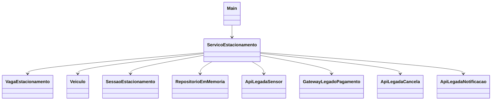

# Diagrama de classes - estado inicial

```mermaid
classDiagram
    Main --> ServicoEstacionamento
    ServicoEstacionamento --> VagaEstacionamento
    ServicoEstacionamento --> Veiculo
    ServicoEstacionamento --> SessaoEstacionamento
    ServicoEstacionamento --> RepositorioEmMemoria
    ServicoEstacionamento --> ApiLegadaSensor
    ServicoEstacionamento --> GatewayLegadoPagamento
    ServicoEstacionamento --> ApiLegadaCancela
    ServicoEstacionamento --> ApiLegadaNotificacao
```

Atualize este diagrama quando a estrutura do projeto for modificada.
