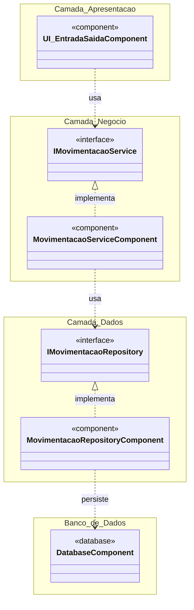

# Diagrama de componentes - estado inicial

A estrutura evidencia a centralização inicial no serviço. Na Aula 05, a equipe deverá revisar componentes, conectores e configuração conforme o código evoluído.
