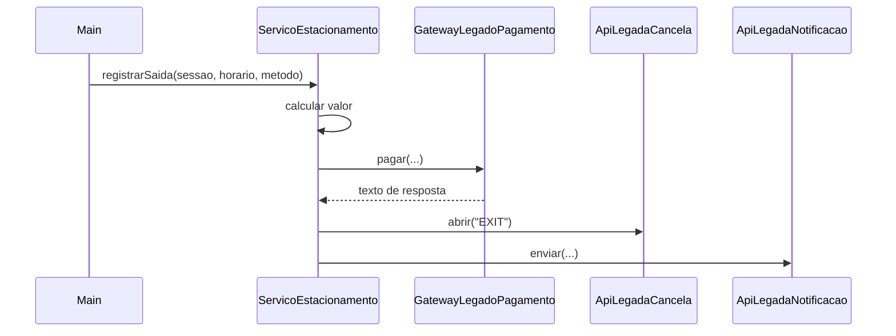

# Sequência inicial - saída do veículo

```mermaid
sequenceDiagram
    participant M as Main
    participant S as ServicoEstacionamento
    participant P as GatewayLegadoPagamento
    participant G as ApiLegadaCancela
    participant N as ApiLegadaNotificacao

    M->>S: registrarSaida(sessao, horario, metodo)
    S->>S: calcular valor
    S->>P: pagar(...)
    P-->>S: texto de resposta
    S->>G: abrir("EXIT")
    S->>N: enviar(...)
```

Na Aula 11, este fluxo deverá ser analisado quanto a contratos, dependências, sincronismo, desempenho e confiabilidade.
